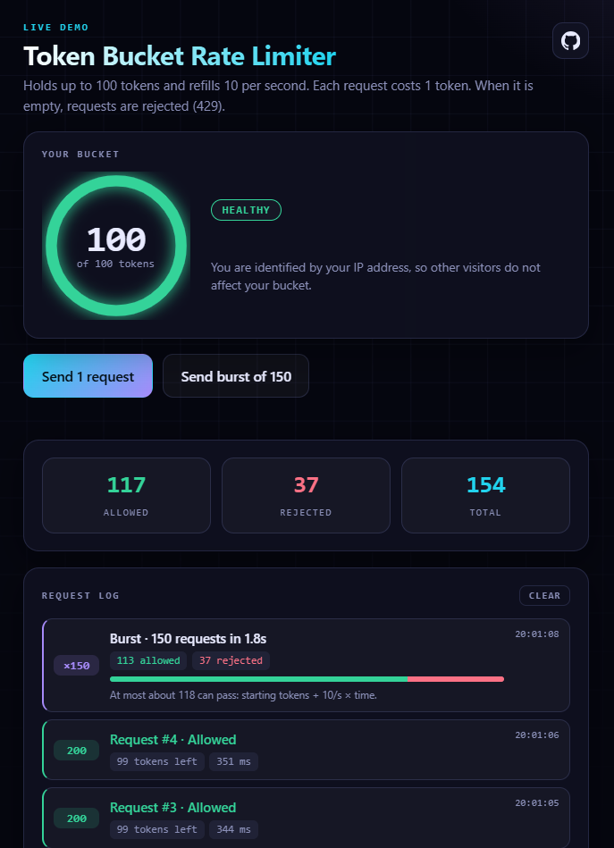
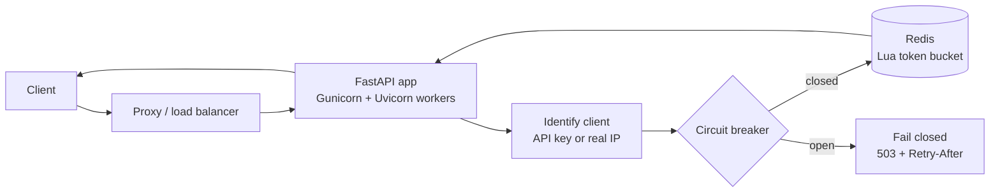

# Token Bucket Rate Limiter Service

A distributed rate limiting service built with **FastAPI**, **Redis**, and an atomic **Lua** script. It decides, per client, whether a request is allowed, and fails safely when its dependencies break.

**Live demo (interactive, try it in your browser):** https://token-bucket-rate-limiter-372o.onrender.com/

> The demo runs on a free hosting tier that sleeps when idle. The first request after a quiet period can take 30 to 60 seconds to wake it up.

Or call the API directly:

```bash
curl -i https://token-bucket-rate-limiter-372o.onrender.com/v1/check
```

## Features

- **Token bucket algorithm** with configurable capacity and refill rate, run atomically inside Redis (a single Lua script), so concurrent workers never double-spend tokens.
- **Redis is the only clock.** Time is read inside the script, not supplied by the app servers (see [Design decisions](#design-decisions)).
- **Fails closed.** If Redis is unreachable, requests get `503` with `Retry-After` instead of being let through unchecked. A setting switches to fail-open.
- **Circuit breaker.** After repeated Redis failures the service stops calling Redis and rejects instantly, then probes periodically and recovers on its own.
- **Spoof-resistant client identity.** `X-Forwarded-For` is trusted only from configured proxies; API keys are checked against stored SHA-256 hashes.
- **Standard headers:** `X-RateLimit-Limit`, `X-RateLimit-Remaining`, `X-RateLimit-Reset`, `Retry-After`.
- **Operational endpoints:** `/health` (liveness) and `/ready` (checks Redis).
- **Interactive demo page** served by the app itself, so anyone can watch the limiter work in the browser.
- **Hardened Redis setup:** password, not exposed to the host, memory cap with eviction.

## Interactive demo

Open the [Live URL](https://token-bucket-rate-limiter-372o.onrender.com/) to try the limiter without any tools.



- **Send 1 request** shows the result (`200` allowed or `429` rejected), the tokens left, and a `Retry-After` countdown.
- **Send burst of 150** fires 150 requests at once and shows when they flip from allowed to rejected, along with the most that could have passed (starting tokens + refill rate × elapsed time).
- A **live bucket bar** drains with every request and refills over time.

How it works:

- Every click sends a real `GET /v1/check` to the server (visible in the browser's Network tab). The allowed/rejected result and the "tokens left" figure come from the response and its `X-RateLimit-*` headers.
- Only the bar *between* responses is estimated: the last known level plus refill rate × time elapsed. The next response replaces the estimate with the true value, and the page labels it as estimated.
- Visitors are identified by IP address (the page contains no API key), so one visitor's clicks do not affect another's. People behind the same network share a bucket.
- The page is a single dependency-free HTML file served by the same FastAPI app at `/`, with capacity and refill rate injected from the server's settings. Being same-origin, it needs no CORS configuration. API responses carry `Cache-Control: no-store` so no proxy can cache a rate limit decision.
- After a quiet period the free host needs time to wake up; the page shows a "waking up" note instead of looking broken.

## Architecture



## API

### `GET /v1/check`

Optional header `X-API-Key`. Without a key, the client is identified by IP address.

| Status | Meaning |
|---|---|
| `200` | Allowed |
| `401` | Invalid or missing API key (charged to the caller's IP bucket, so key guessing is throttled) |
| `429` | Rate limit exceeded, with `Retry-After` |
| `503` | Rate limiter unavailable (fail closed), with `Retry-After` |

Response headers: `X-RateLimit-Limit`, `X-RateLimit-Remaining`, `X-RateLimit-Reset`. When running fail-open and Redis is down, `X-RateLimit-Degraded: true` is added.

### `GET /health`
Liveness: the process is up. Does not touch Redis, since restarting the app cannot fix a Redis outage.

### `GET /ready`
Readiness: pings Redis. Returns `503` if Redis is unreachable.

### `GET /`
The [interactive demo page](https://token-bucket-rate-limiter-372o.onrender.com/).

## Run locally

Requires Docker.

```bash
# 1. Create a client key and its hash (give the KEY to the client, store only the HASH)
python -c "import secrets,hashlib; k=secrets.token_urlsafe(32); print('KEY :',k); print('HASH:',hashlib.sha256(k.encode()).hexdigest())"

# 2. Create a .env file next to docker-compose.yml
#    REDIS_PASSWORD=<any long random string>
#    API_KEY_HASHES=<the HASH from step 1>

# 3. Start everything
docker compose up --build -d

# 4. Try it
curl -i http://localhost:8000/v1/check
curl -i http://localhost:8000/v1/check -H "X-API-Key: <your KEY>"
```

## Configuration

All settings are environment variables (see `app/config.py`).

| Variable | Purpose | Default |
|---|---|---|
| `DEFAULT_CAPACITY` | Bucket size (maximum burst) | `100` |
| `DEFAULT_REFILL_RATE` | Tokens added per second | `10` |
| `FAIL_OPEN` | `false` = reject when Redis is down, `true` = allow | `false` |
| `ALLOW_ANONYMOUS` | Allow requests without an API key (bucketed by IP) | `true` |
| `API_KEY_HASHES` | Comma-separated SHA-256 hashes of valid keys | empty |
| `TRUSTED_PROXIES` | Comma-separated CIDRs allowed to set `X-Forwarded-For` | empty |
| `CB_FAILURE_THRESHOLD` | Consecutive Redis failures before the breaker opens | `3` |
| `CB_RECOVERY_TIMEOUT` | Seconds before the breaker probes Redis again | `5.0` |
| `REDIS_HOST` / `REDIS_PORT` / `REDIS_PASSWORD` | Redis connection | |
| `REDIS_MAX_CONNECTIONS` | Connection pool size per worker | |
| `WEB_CONCURRENCY` | Gunicorn worker count | `4` |

## Testing and results

Load tests use [k6](https://k6.io). `load_test.js` has several scenarios, selected with `-e TEST=...`; `live_test.js` is a light burst test for the deployed service.

```bash
k6 run -e TEST=burst load_test.js        # also: sustained, manykeys, stress, outage, auth, spoof
```

For one client, the number of allowed requests should be **capacity + refill rate × duration**. Each test checks results against that formula.

### Local (Docker Desktop on a laptop, k6 on the same machine)

| Test | Expected | Result |
|---|---|---|
| Burst: 1000 requests, one client | about 105 allowed | **105 allowed**, 895 rejected |
| Sustained: 30 req/s for 30s, one client | about 400 allowed | **399 allowed**, 502 rejected |
| 200 req/s across many clients | no errors, low latency | 0% failures, **p95 4.9 ms**, p99 9.2 ms |
| Redis stopped mid-run (breaker enabled) | 503s, then recovery | 2189 requests got `503`; every response was `200` or `503`; **p95 4.2 ms** |
| 300 requests with 300 different forged `X-Forwarded-For` values, proxies untrusted | share one bucket | **101 allowed** of 300 |
| Invalid key / valid key | `401` / `200` | passed |

### Deployed (Render free tier, Oregon; k6 run from India)

| Test | Result |
|---|---|
| 300 requests, 20 at a time, one API key, 6.5 s | **154 allowed**, 146 rejected (limit by formula: 165). All checks passed. |

Hosted latency is higher (p95 811 ms, fastest request 281 ms) than the local figures. That is mostly network distance plus a very small free-tier CPU, so the two sets of numbers should not be compared directly.

## Design decisions

**Redis is the single clock.** An early version passed Python's `time.time()` into the Lua script. With 4 workers handling requests slightly out of order, an older timestamp could move a bucket's `last_updated` backwards, so the same interval of time was credited twice: the 1000-request burst allowed **152** requests instead of about **105**. Reading `redis.call("TIME")` inside the script fixed it. The lesson: in a distributed system, never let each client supply its own timestamp to a shared counter.

**Fail closed by default.** If the limiter cannot decide, it rejects with `503` rather than letting unchecked traffic through, because a limiter that disappears under pressure protects nothing. `FAIL_OPEN=true` flips this for services that prefer availability.

**Circuit breaker.** Without it, every request during a Redis outage waited for the Redis timeout: p95 latency was **1 s** and requests piled up. With the breaker, outage responses come back in a few milliseconds (p95 **4.2 ms**), and one probe request per interval detects recovery. The breaker is per worker process.

**Identity that cannot be spoofed cheaply.** `X-Forwarded-For` is only honored when the direct connection comes from a trusted proxy, and it is read from the right so entries typed by the client are ignored. Unknown API keys cannot create buckets (keys are checked against hashes), and Redis only ever sees a hash prefix, never the raw key. IPv6 clients are grouped by /64 so a single customer cannot rotate addresses.

**Memory-bounded Redis.** A memory cap with LRU eviction means many unique clients degrade gracefully (an evicted client simply gets a fresh bucket) instead of filling Redis and causing write errors.

## Deployment (Render free tier)

- Web service (Docker, 1 worker) and a free Key Value (Redis-compatible) instance in the same region, connected over the private network.
- `TRUSTED_PROXIES` is set to Render's internal range plus Cloudflare's published ranges, which I confirmed by inspecting the forwarded headers the service actually receives.
- Free-tier notes: the service sleeps when idle, and the free Redis keeps no data on disk, so a restart resets all buckets. The limiter recovers from this automatically (script reload and circuit breaker).

## Known limitations and future work

- **Single Redis.** There is no replica, so a Redis outage means `503` for everyone until it returns. Production use should run a managed Redis with automatic failover (the app already survives failover through the breaker and script reload).
- **No automated CI yet.** The load tests are run by hand. Unit and integration tests in CI are the next step.
- **No metrics endpoint yet.** Adding Prometheus metrics (allowed, rejected, fail-closed counts, latency, breaker state) would make outages visible.
- **API keys live in an environment variable.** Changing keys needs a redeploy; per-key limits and tiers would need a small key store.
- **Cloudflare ranges are a fixed list**, and a determined attacker sending traffic through Cloudflare's own network may still be able to forge an address. A header from the host that clients cannot forge would be the stronger fix.

## Project layout

```
app/
  main.py          # endpoints
  config.py        # settings
  core/
    limiter.py     # rate limit check, circuit breaker, fail-open/closed
    identity.py    # trusted-proxy client IP and API key validation
    redis.py       # connection pool and Lua script loading
  static/
    index.html     # interactive demo page
lua/
  token_bucket.lua # atomic token bucket
load_test.js       # k6 scenarios (local)
live_test.js       # k6 burst test (deployed)
Dockerfile
docker-compose.yml
```